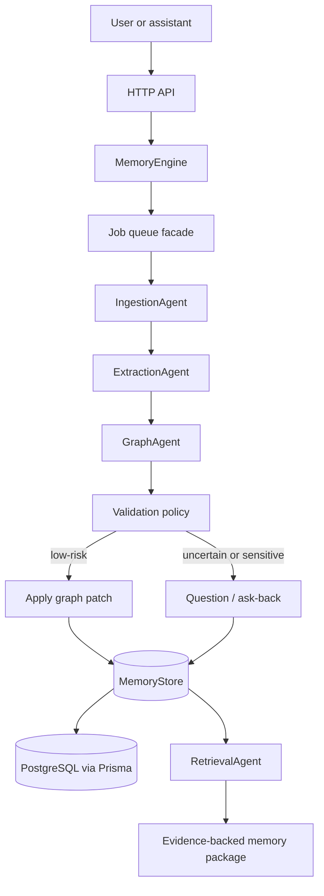
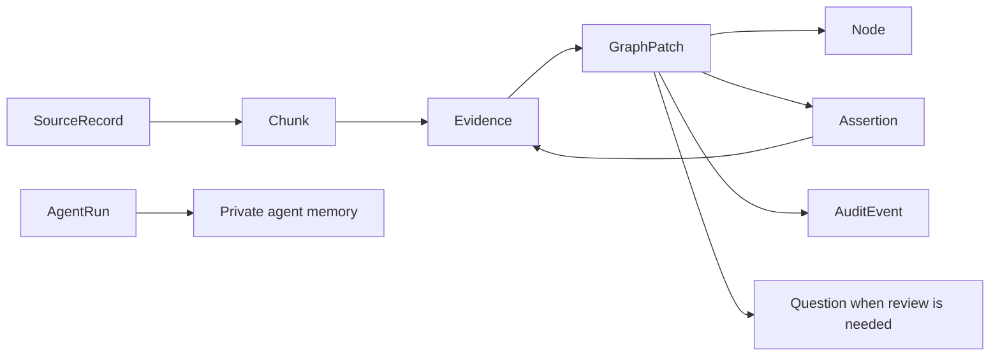
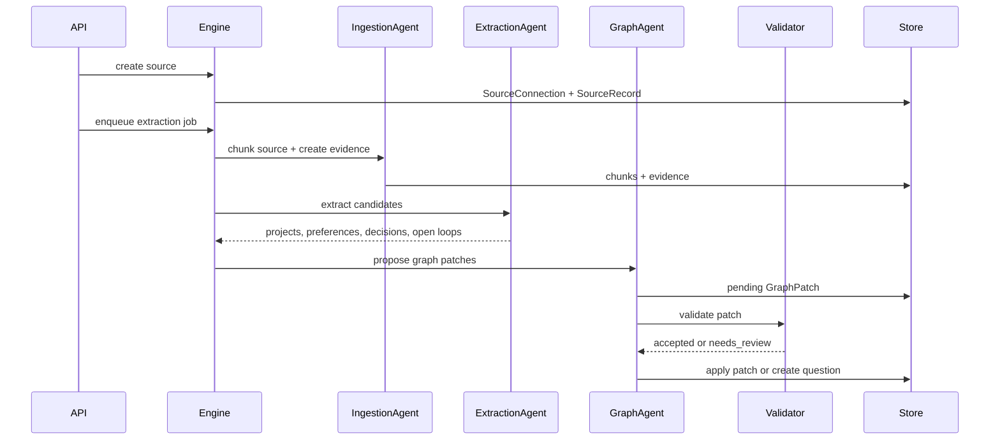

# open-Memory

`open-Memory` is a backend-first prototype for **agent-maintained personal long-term memory**.

The core idea is not "save text and search it later." The system ingests personal sources, extracts candidate memories, stores them as typed graph state with evidence, and keeps them maintained through agents. Memories can be accepted, reviewed, forgotten, made private, or queried with provenance.

## Current State

This repo currently implements a local TypeScript backend with:

- Fastify HTTP API for source ingestion, jobs, patches, questions, retrieval, and forgetting.
- Agent pipeline for ingestion, extraction, graph patching, validation, maintenance, retrieval, and private agent memory.
- Patch-based memory mutation with audit events.
- Prisma-backed PostgreSQL persistence by default.
- In-memory store for isolated unit tests and explicit `MEMORY_STORE=memory` development.
- Prisma migration for the persistent schema.

## System Shape



## Memory Model

The runtime works through a `MemoryStore` interface. Agents do not directly mutate durable memory. They propose graph patches, validators decide whether a patch can be accepted, and applied patches emit audit events.



Important separation:

- **Personal memory** stores what the user may want remembered.
- **Agent private memory** stores operational lessons for agents.
- Agent private memory cannot be cited as evidence for personal facts.

## Agent Pipeline



## Backend Interfaces

Implemented API areas:

```text
POST /sources/manual
POST /sources/files
POST /sources/notes/import

POST /ingestion/jobs
GET  /jobs/:id

GET  /nodes
GET  /assertions
GET  /patches
POST /patches/:id/accept
POST /patches/:id/reject

GET  /questions
POST /questions/:id/answer

POST /memory/query
POST /memory/forget

GET  /agents/runs
GET  /agents/memory
```

## Local Setup

Install dependencies:

```bash
npm install --cache /tmp/open-memory-npm-cache
```

Create environment config:

```bash
cp .env.example .env
```

Start Postgres and run migrations:

```bash
docker compose up -d postgres
npm run db:migrate
```

Start the backend:

```bash
npm run dev
```

The default runtime store is Prisma/PostgreSQL. For a temporary non-persistent runtime:

```bash
MEMORY_STORE=memory npm run dev
```

## API Smoke Test

Health check:

```bash
curl http://127.0.0.1:3000/health
```

Add a manual memory:

```bash
curl -X POST http://127.0.0.1:3000/sources/manual \
  -H 'content-type: application/json' \
  -d '{"userId":"user","title":"Current work","text":"I am working on open-Memory and building a backend memory engine."}'
```

Query memory:

```bash
curl -X POST http://127.0.0.1:3000/memory/query \
  -H 'content-type: application/json' \
  -d '{"userId":"user","query":"open-Memory","includeEvidence":true}'
```

List pending review items:

```bash
curl http://127.0.0.1:3000/patches?status=needs_review
curl http://127.0.0.1:3000/questions?status=open
```

## Development Commands

```bash
npm run typecheck
npm test
npm run build
npm audit
```

Database-backed tests require Postgres from `.env`:

```bash
docker compose up -d postgres
npm run db:migrate
npm run test:db
```

Prisma commands:

```bash
npm run db:generate
npm run db:migrate
npm run db:reset
```

## Repository Layout

```text
src/agents/          agent services for ingestion, extraction, graph updates, maintenance, retrieval
src/domain/          shared memory types and policies
src/engine/          MemoryEngine orchestration
src/http/            Fastify routes and request schemas
src/queue/           in-process job queue facade
src/repositories/    MemoryStore interface, in-memory store, Prisma store
prisma/              schema and migrations
tests/               unit and DB integration tests
```

## Design Principles

- Memory changes go through patches.
- Accepted memory must have evidence.
- Sensitive or uncertain memories become questions.
- Forgetting must remove memory from retrieval.
- Agent private memory improves agents, but is not personal truth.
- Retrieval returns evidence-backed memory packages, not loose chunks.

## Roadmap

Near-term backend work:

- Replace the in-process queue with a durable Redis/BullMQ worker runtime.
- Add real embedding generation and pgvector similarity search.
- Add stronger extraction providers behind a deterministic adapter.
- Add source connectors beyond manual/files/notes.
- Add migration-safe seed and fixture workflows for DB tests.
- Expand maintenance agents for freshness, contradiction, and evidence integrity.

## Documents

- [Agentic Knowledge Graph Spec](AGENTIC_KNOWLEDGE_GRAPH_SPEC.md)
- [System Design Plan: Personal Long-Term Memory](SYSTEM_DESIGN_PLAN.md)

